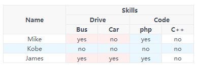

# ExTable
# 扩展的`<table>`标签
##### 仅支持Vue.js

扩展的`<table>`标签，支持多层表头，支持固定列，支持单元格渲染
ExTable一开始就是为了满足iView无法实现的多层表头功能而开发，所以样式风格与iView一致
可以在不引入iView的情况下，独立使用

----
Usage:

```html
<template lang="html">
    <div class="hello-ex-table">
        <ExTable class="ex-table" :columns="columns" :data="data"></ExTable>
    </div>
</template>

<script>
import ExTable from '@/components/table';

export default {
    components: {
        ExTable
    },
    data() {
        return {
            columns: [{
                title: 'Name',
                key: 'name',
                width: '120px'
            }, {
                title: 'Skills',
                child: [{
                    title: 'Drive',
                    child: [{
                        title: 'Bus',
                        key: 'bus'
                    }, {
                        title: 'Car',
                        key: 'car'
                    }]
                }, {
                    title: 'Code',
                    child: [{
                        title: 'php',
                        key: 'php'
                    }, {
                        title: 'C++',
                        key: 'cpp'
                    }]
                }]
            }],
            data: [{
                name: 'Mike',
                bus: 'yes',
                car: 'no',
                php: 'yes',
                cpp: 'no'
            }, {
                name: 'Kobe',
                bus: 'no',
                car: 'no',
                php: 'no',
                cpp: 'no'
            }, {
                name: 'James',
                bus: 'yes',
                car: 'yes',
                php: 'yes',
                cpp: 'no'
            }]
        };
    }
};
</script>

<style lang="less">
.hello-ex-table {
    width: auto;
    height: 100%;
    .ex-table {
        width: 100%;
        height: 500px;
    }
}
</style>
```

Result:

